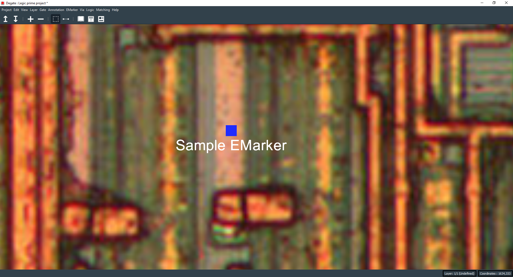

EMarker
==================================

An EMarker is a general connectable electrical object, it representation of an electrically connectable marker object. It can represent any non-available electrical object in Degate (it's barely a placeholder).

You can set these properties for a EMarker : a name, a description, if the EMarker is a module port and a fill color. To set an EMarker diameter, see the project settings dialog (from the "Project" submenu of the top bar).