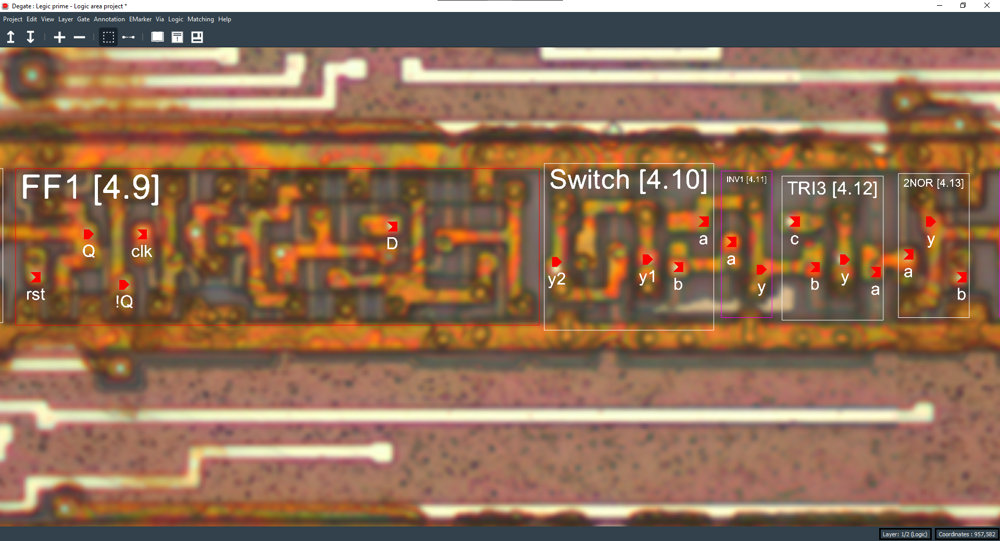
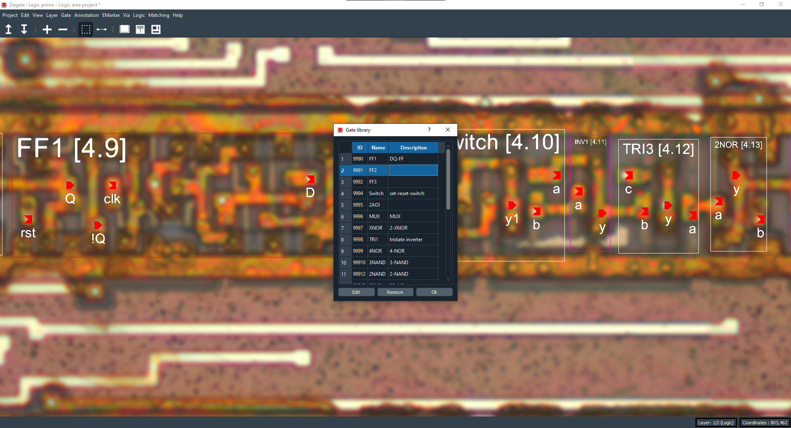
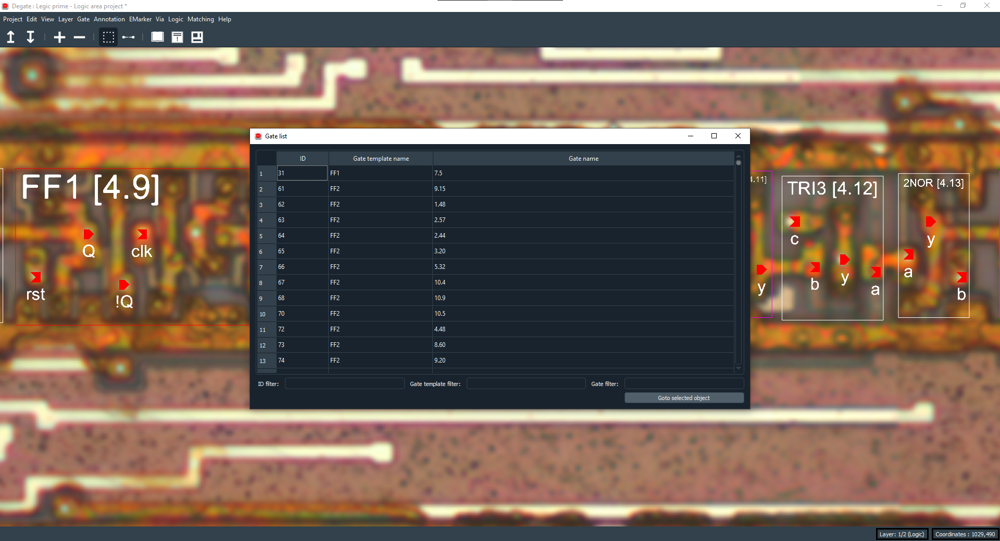
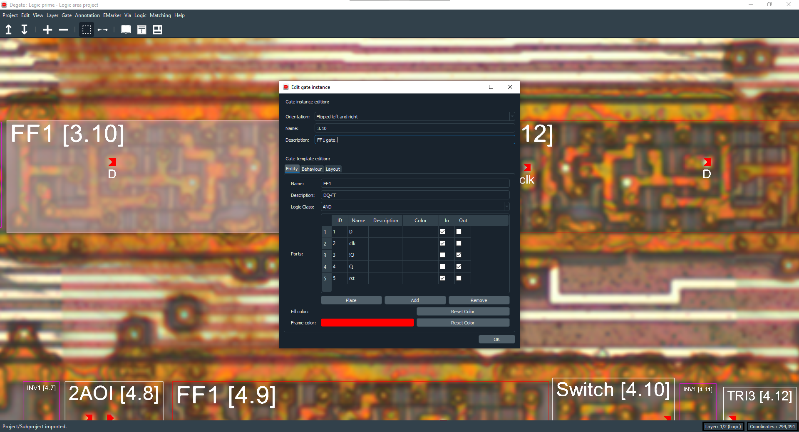
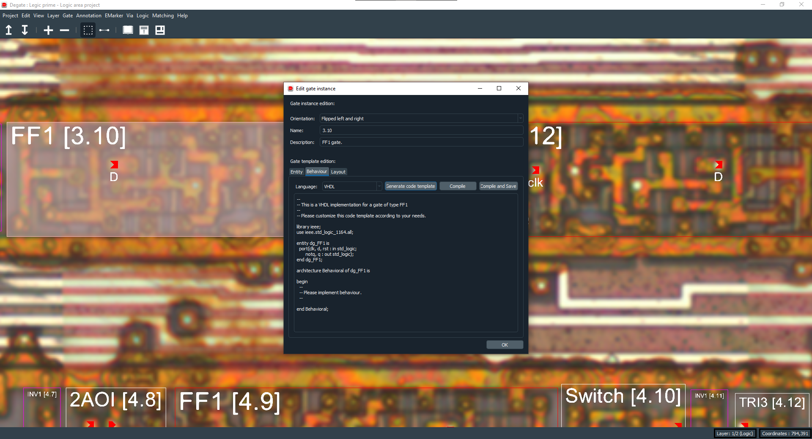
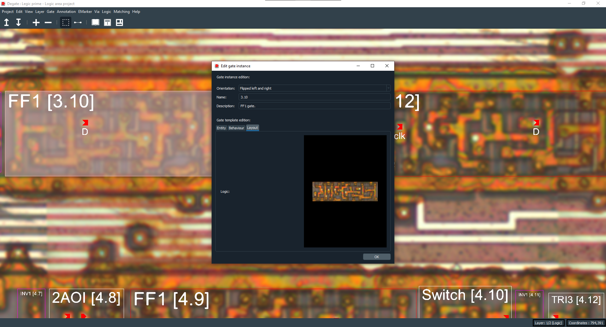

Gate
==================================

There are two separate concepts involving gates : gate instances and gate templates.

Gate templates
--------------

A gate template represents a gate type (like an inverter, a flip-flop...) that can be analysed, had a specific behaviour (coded in VHDL for example) and be reused and instantiated somewhere else. A gate instance (what appears in the workspace) is always derived from a gate template.

You can access a list of gate templates with the gate library dialog available in the toolbar or in the "Gate" submenu of the top bar.

Gate instances
--------------

A gate instance is a representation of a physical implementation of a gate template. To create a gate instance, you always need to have the corresponding gate template already created.

Gate edit
--------------

You can edit a gate instance (or a gate template from the gate library) by double clicking on it or by using the "Edit selected" from the "Gate" submenu of the top bar. In it, you will find three tabs : entity, behaviour and layout.

Entity tab
~~~~~

The entity tab will let you edit basic information about the gate template like colors, name, description, ports...

Behaviour tab
~~~~~

The behaviour tab will let you set the logic behind a gate, his behaviour. You can set it with free text, in VHDL or in Verilog. You will then be able to compile and test it with gtkwave (for Verilog only).

Also, when the behaviour is set, you can export it when it's inside a module, and if the module is the project top level module, it will export the whole netlist.

.. warning:: You can only export a module in Verilog so, if you want to be able to export the whole netlist, use Verilog to set gate instances behaviour.

Layout tab
~~~~~

The layout tab will show you images of a gate instance for the gate template that's being edited on one metal layer (if set), one logic layer (mandatory, so always set) and one transistor layer (if set).  

