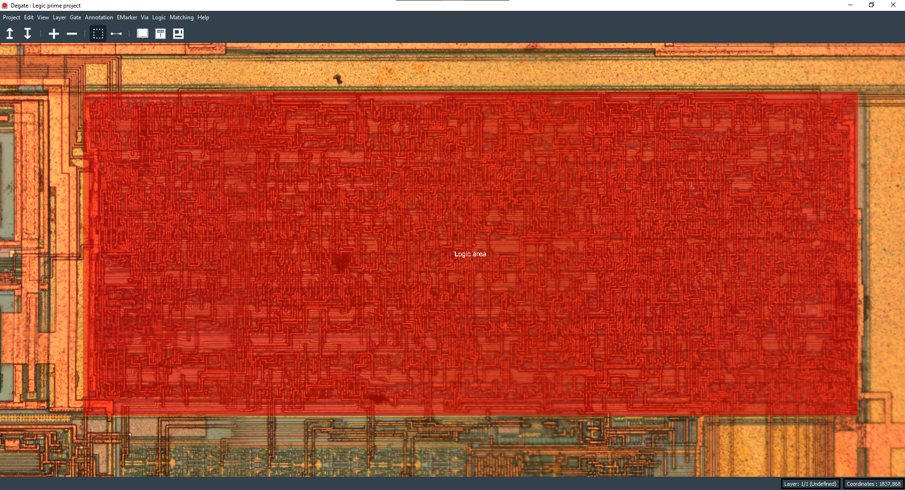
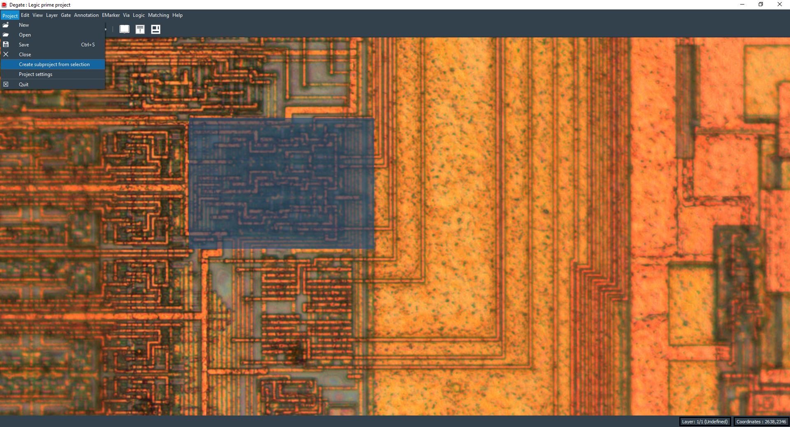

Subproject
==================================

A subproject is a clickable annotation, with a double click you can close and save the current project and open the concerned subproject.

Create subproject
-----

To create a subproject, you need to select an area with the right click, go to the "Project" submenu of the top bar, and click on "Create a subproject from selection".

Then, it will ask you to create a new project, as presented in a previous page (even if it's a subproject).