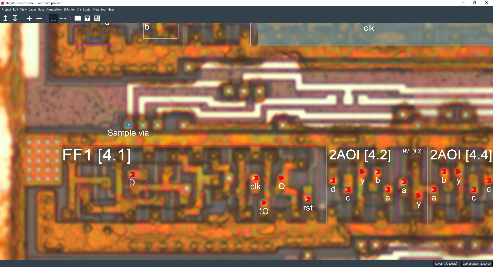
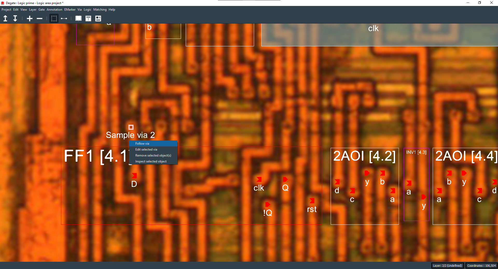

Via
==================================

A via is an electrical connectable object that will represent an electrical connection between two adjacent layers.

To create a via, you can right click to open the context menu, and select "Create new via". To connect two vias, you need to electrically interconnect them (by switching layers and CTRL + Right click to select them).

You can also connect a via to other objects (like ports or wires...).

You can follow a connected via to go to the interconnected layer, by right clicking and selecting the "Follow via" option in the context menu.