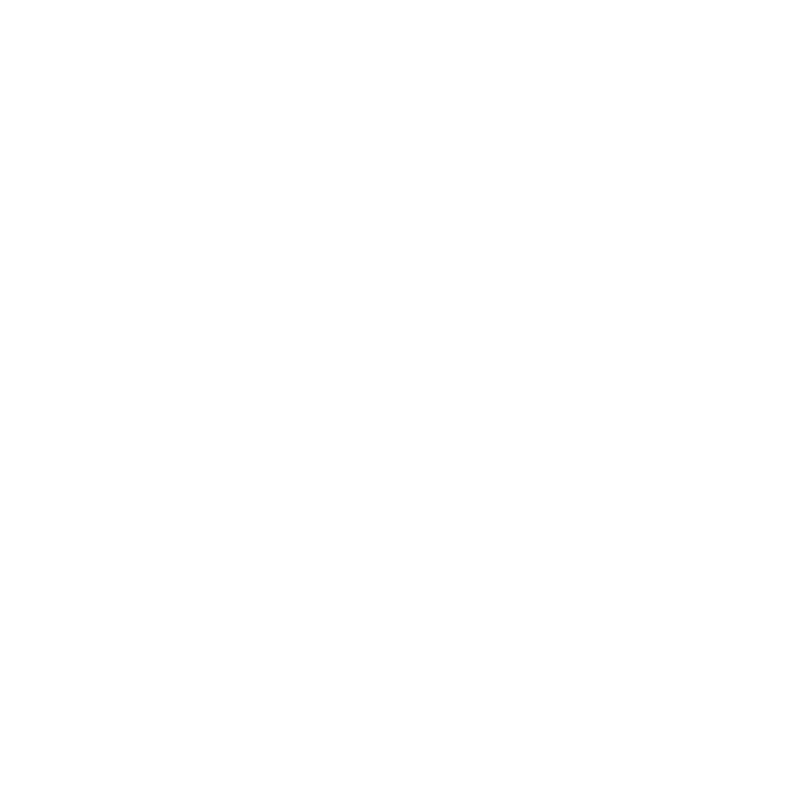
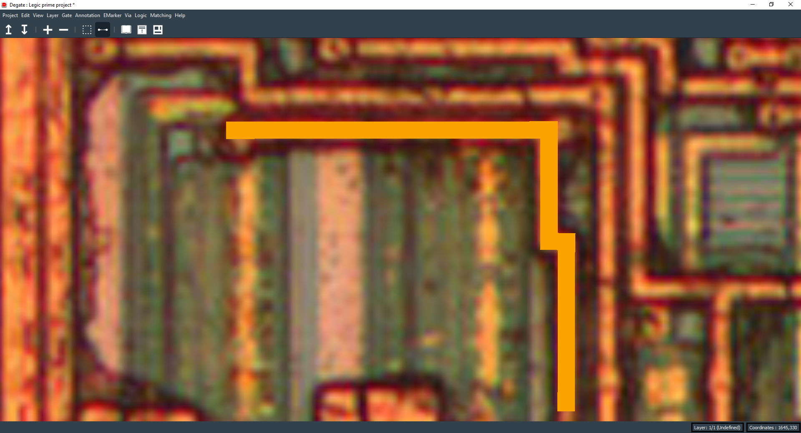

Wire
==================================

You can create a wire, that is a connectable electrical object, with the wire tool and by right clicking and moving the mouse.

By default, each new wire first point will be the end of the previous one. To reset the wire tool, right click to open the context menu and click on "Reset wire tool".

You should limit the number of wires to keep the workspace clean, for example, if a wire connects two gate ports, just interconnect them and avoid creating an intermediate wire.