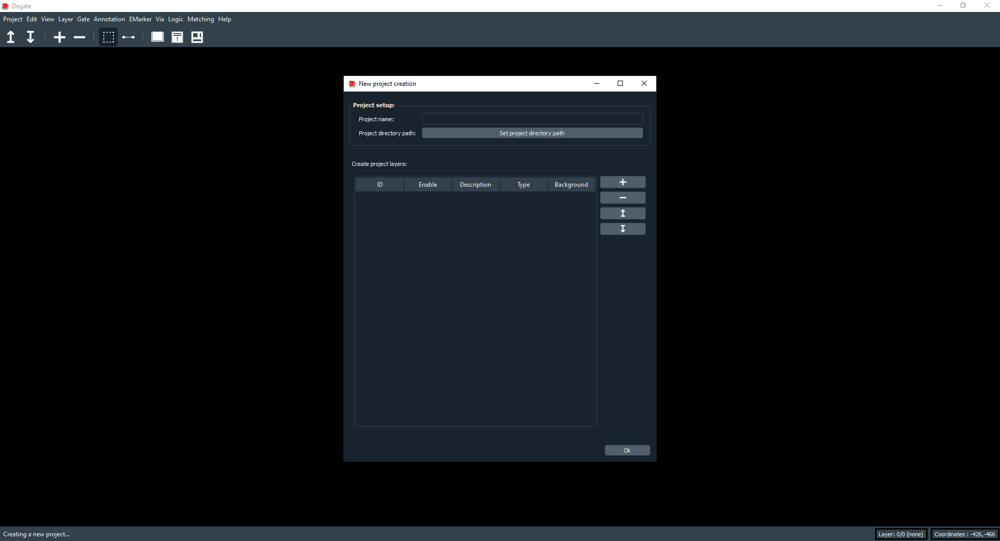
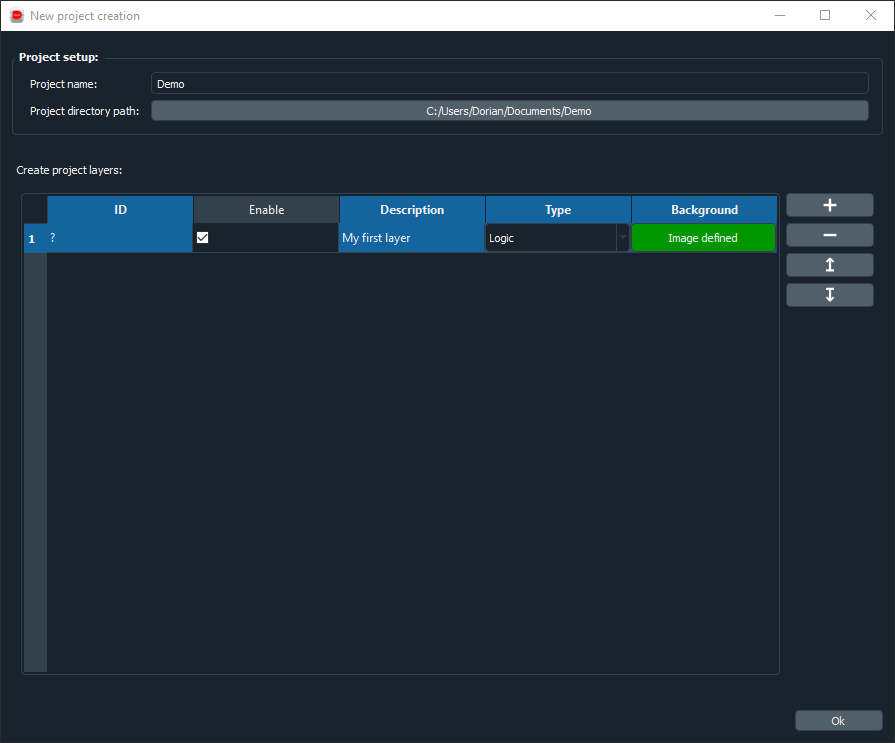
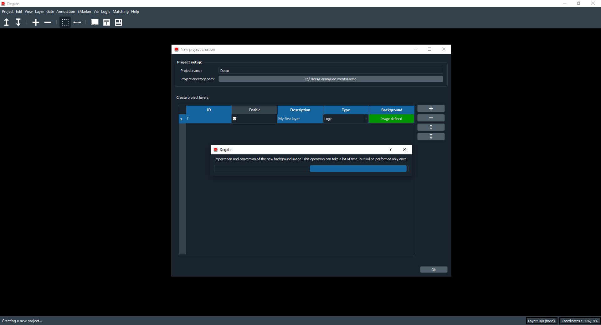

Create a new project
==================================

.. note:: The **old Degate** was using a size based project system, with a static project size defined during project creation. This meant inability to change the size after the project creation, even when you add a larger image than previously planned (so, with the old Degate, you had to recreate the project 'from scratch'). The **new Degate** uses a different system, you no longer have to worry about the project size during creation, you just need to provide at least one layer with a valid image.

Images alignment
--------------

A Degate project needs only **layer images** to start. They will be the core of the project and the core of the process to recover the netlist (or a part of it). However there is some condition that you need to take care before creating the project (you can reimport layer images after the project creation, so no worries):

- The layer images need to be aligned (they must be able to overlap correctly).
- The layer images need to have the same overall quality (this is not mandatory, but if they are not of the same quality, you will have pain to align them).

.. warning:: **Very important**: Degate has (for the moment) no built-in tools to align layer images, you have to do this downstream.

To align these layer images, you have to consider that Degate cannot shift them, they will be open directly and placed in 0,0 (upper left corner). So, if these layer images are not aligned from the upper left corner, there will be an offset between the layers.

Project creation dialog
--------------

You can access the project creation dialog from the "Project" tabs of the top menu, and by pressing the "New" button of this submenu. You will arrive on this window:

With this dialog, you will be able to set the project name, the project directory path and the project layers. The project directory path is the directory where the project directory will be created. You will need at least one valid layer with an image set. To add a layer, you need to click on the "+" button. After that, a new layer will appear where you can set the state (if disabled, you will not see it inside the workspace, this can be changed anytime), the description, the type and the image.

The type of a layer can be of these 4 types:

- **Undefined**: undefined layer (useful if you want to start the analysis later).
- **Metal**: interconnection layer (M1, M2 M...).
- **Logic**: the layer where you will define gates.
- **Transistor**: transistor layer.

To learn more about these types, please see the Layman's Guide to IC Reverse Engineering `here <http://siliconzoo.org/tutorial.html>`_.

To set the background image, you need to click on the red button, it will open a new dialog to select an image to import. After that done, you just need to click on "Ok" to validate and wait during the image(s) importation.

After clicking "Ok" you will get a loading dialog:

Well done ! Your project is now created and loaded.