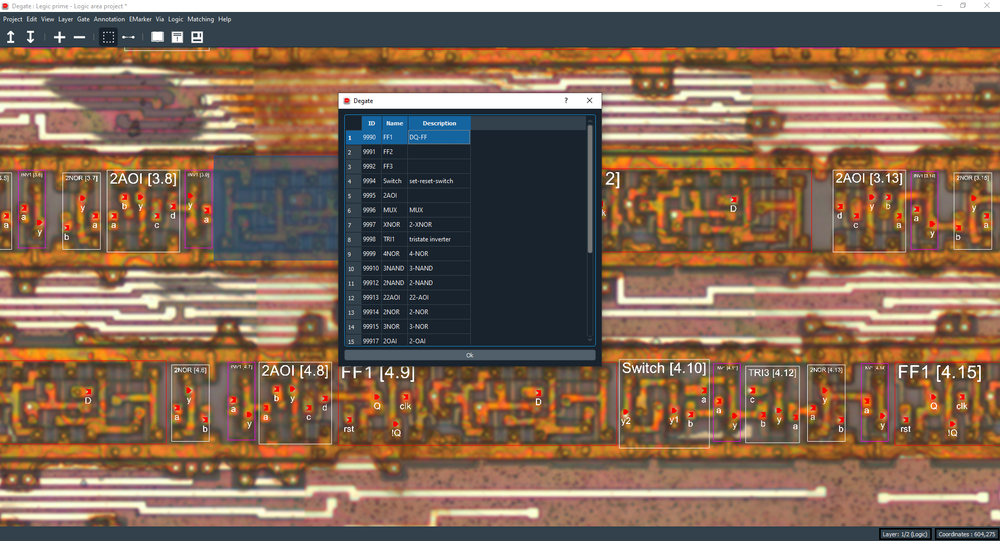
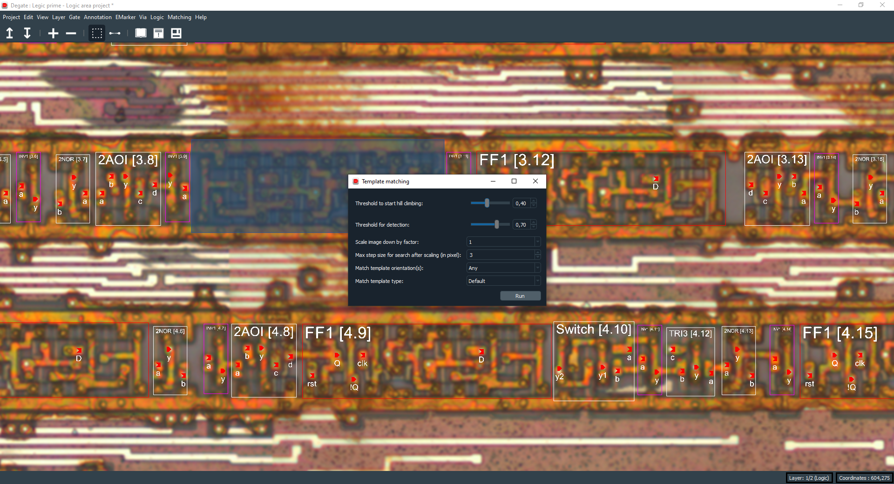
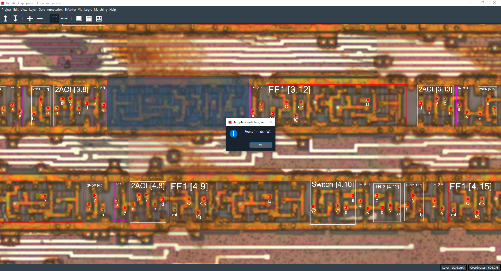
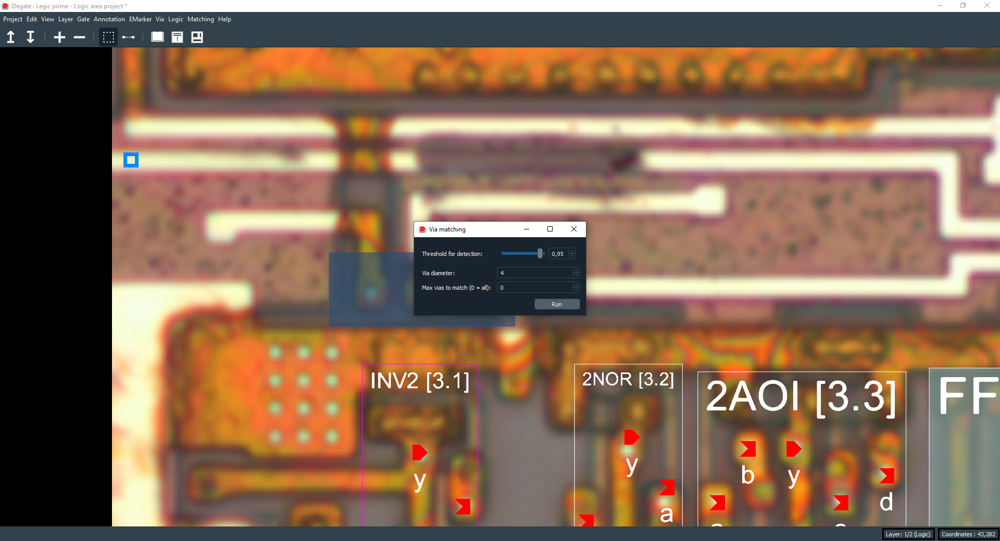

Matching
==================================

To start a "matching phase" you firstly need to select an area (by holding the right click) to define the area used to match templates, vias or wires. This is optional, if you don't select an area, the whole project size will be used. Also, please note that the "matching phase" will use the current selected/active layer.

You can access the different "matching phase" types in the "Matching" top bar submenu.

Template matching
-----

Template matching will automatically detect gate template inside an area. After selecting the area, select "Template matching" in the "Matching" top bar submenu. You will then fall on this dialog:

You need to select the desired gate(s) template to match (you need at least one). Then, you will fall on this dialog:

To start the template matching phase, you can adjust different options, which are:

+----------------------------------------+-------------------------------------------------------------------------------------------------------------------------------------------------------------------------------------------------------------------------------+
| Option name                            | Meaning                                                                                                                                                                                                                       |
+========================================+===============================================================================================================================================================================================================================+
| Threshold to start hill climbing       | The threshold to start looking for a gate template. If the value is low, it will take more time to complete.                                                                                                                  |
+----------------------------------------+-------------------------------------------------------------------------------------------------------------------------------------------------------------------------------------------------------------------------------+
| Threshold for detection                | The threshold to confirm the detection of a gate template. If the value is low, it will take more time to complete. This value should be greater than the one above.                                                          |
+----------------------------------------+-------------------------------------------------------------------------------------------------------------------------------------------------------------------------------------------------------------------------------+
| Scale image down by factor             | The scaled version of the image to use during the detection. The more the image will be scaled down, the more the time to complete will be low.                                                                               |
+----------------------------------------+-------------------------------------------------------------------------------------------------------------------------------------------------------------------------------------------------------------------------------+
| Max step size for search after scaling | If the value is low (1 pixel minimum), it will take more time to complete, but will be more accurate. This value depends on the scaled version of the image (if the image is very scaled, it's better to use a value near 1). |
+----------------------------------------+-------------------------------------------------------------------------------------------------------------------------------------------------------------------------------------------------------------------------------+
| Match template orientation(s)          | Orientation(s) to search for a gate template. For example, if you select only the normal orientation, if there is the same gate template but flipped, it will not match.                                                      |
+----------------------------------------+-------------------------------------------------------------------------------------------------------------------------------------------------------------------------------------------------------------------------------+
| Match template type                    | Detect for gate template along grid columns or rows. If no grid is available, it will not use any grid.                                                                                                                       |
+----------------------------------------+-------------------------------------------------------------------------------------------------------------------------------------------------------------------------------------------------------------------------------+

After running the template matching, you will obtain a dialog with the results of the detection phase, like that:

Via matching
-----

Via matching in Degate will take all already placed vias as reference (need at least 1), and will use them to match new one(s) with the same layout. After selecting (or not) the matching area, you can access via matching by selecting "Via matching" in the "Matching" top bar submenu. You will then fall on this dialog:

To start the via matching phase, you can adjust different options, which are:

+-------------------------+-----------------------------------------------------------------------------------------------------------------------------------------------+
| Option name             | Meaning                                                                                                                                       |
+=========================+===============================================================================================================================================+
| Threshold for detection | The threshold to detect a via, a higher value will only keep the most matching vias. If the value is low, it will take more time to complete. |
+-------------------------+-----------------------------------------------------------------------------------------------------------------------------------------------+
| Via diameter            | The via diameter to match (default is the project default via diameter value).                                                                |
+-------------------------+-----------------------------------------------------------------------------------------------------------------------------------------------+
| Max vias to match       | Max number of vias to match, it can be useful when you are not sure of your parameters values.                                                |
+-------------------------+-----------------------------------------------------------------------------------------------------------------------------------------------+

Wire matching
-----

.. warning:: Wire matching is a "broken" feature of Degate, it's not working well. However, you can try to use it keeping in mind that this functionality get some limitations.

We will not document this part of Degate due to the warning above, and because it will be completely rewritten shortly.