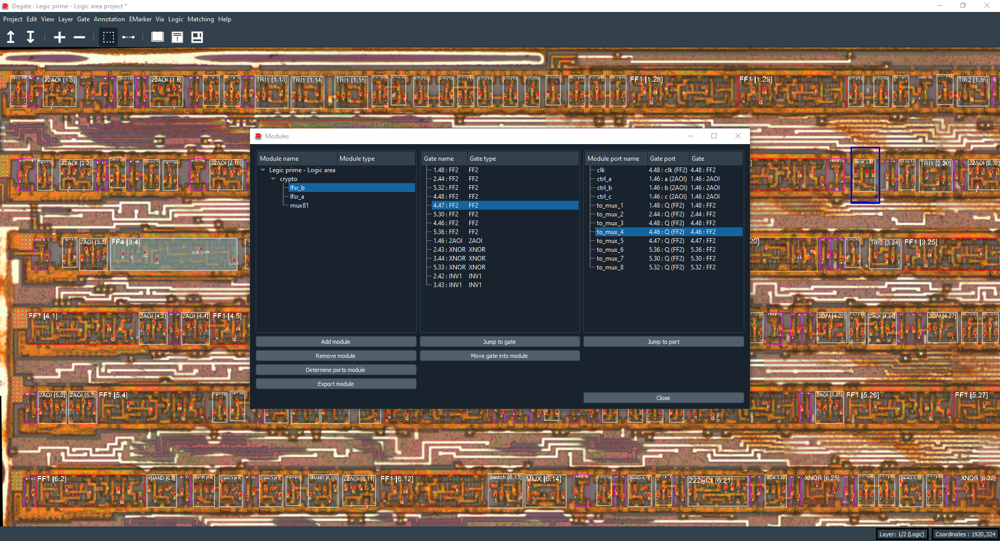

Modules
==================================

Modules are a way to organize your logic model into separate groups and export them (in Verilog language). You always have a top level module, if you want to export your project in Verilog, export the top level module (the one with the project name).

A module can be a child of another one, and every module is the main module child. You can move gates into modules, inside the module dialog or in the workspace with the "Logic" top bar submenu. All gates are, by default, in the project module (top level one).

In this dialog you can find 3 panels, one is the module one, where you can create or remove modules, set a type or export in Verilog. The second one, will show all gates of the selected module. You can move them into another module or jump to them into the workspace. The last panel will show all module ports.

.. warning:: You can only export a module in Verilog.

Module port
-----

A module port is an object connected with other objects (at least one) that are not part of this module.