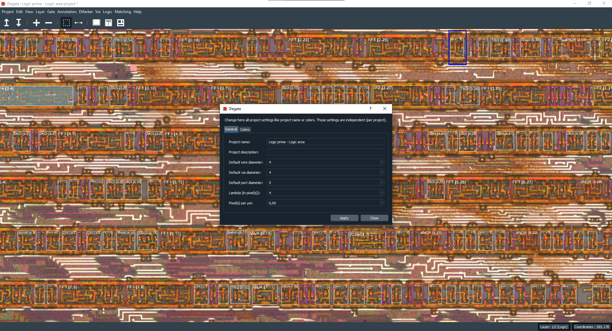

Project settings
==================================

You will find in the project settings dialog (available from the 'Project' submenu of the top bar) different settings for your project. From example, you will be able to change the project name, description, default colors, default diameters and much more.

You will find below a description of the less comprehensive options:

+-----------------------------+--------------------------------------------------------------------------------------------------------------------------------------------------+
| Option                      | Description                                                                                                                                      |
+=============================+==================================================================================================================================================+
| Lambda (in pixel(s)):       | It indicates how many pixels two electrically conductive objects may be apart from each other so that they are still considered to be connected. | 
+-----------------------------+--------------------------------------------------------------------------------------------------------------------------------------------------+