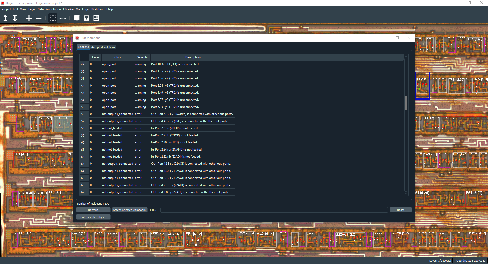
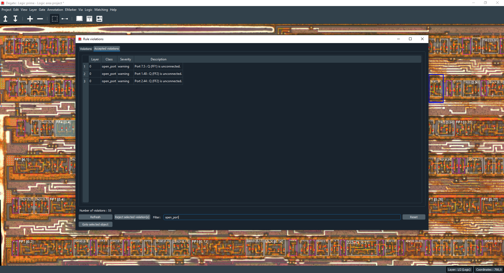

Rule violations
==================================

The rule violations dialog defines will list all violations of the current project regarding the logic model. It will help you to keep track of open ports, unconnected input ports or other potential logic errors.

With this dialog you can also mark a violation as accepted, it will remove it from the violations tab if you consider it's not a real problem/error.

By selecting a violation or accepted violation, you can accept/reject it or go to the concerned object. You also have access to a filter, you just have to write a string of characters and press **"ENTER"** to filter every violation/accepted violation containing the string. The refresh button will enforce a full refresh of all violations and accepted violations (it will recalculate every violation of the logic model).

Possible violations are:

+-----------------------+---------------------------------------------------+
| Violation             | Description                                       |
+=======================+===================================================+
| open_port             | A port is unconnected.                            | 
+-----------------------+---------------------------------------------------+
| net.outputs_connected | An output port is connected with other out ports. |
+-----------------------+---------------------------------------------------+
| net.not_feeded        | An input port is not fed.                         |
+-----------------------+---------------------------------------------------+
