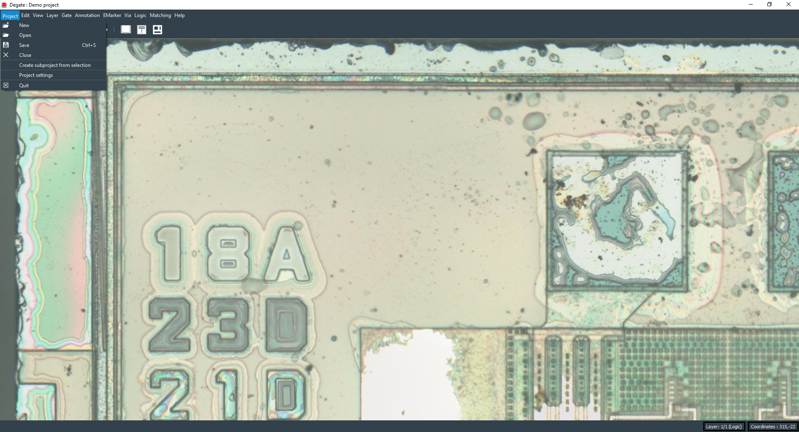
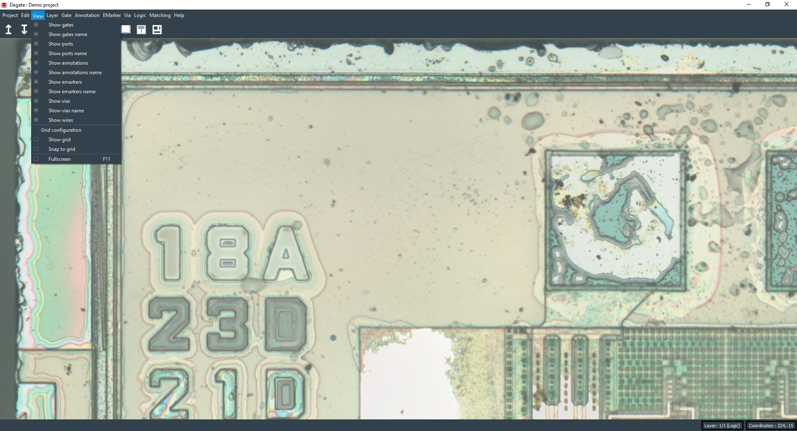
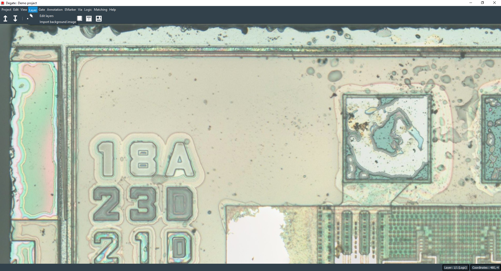
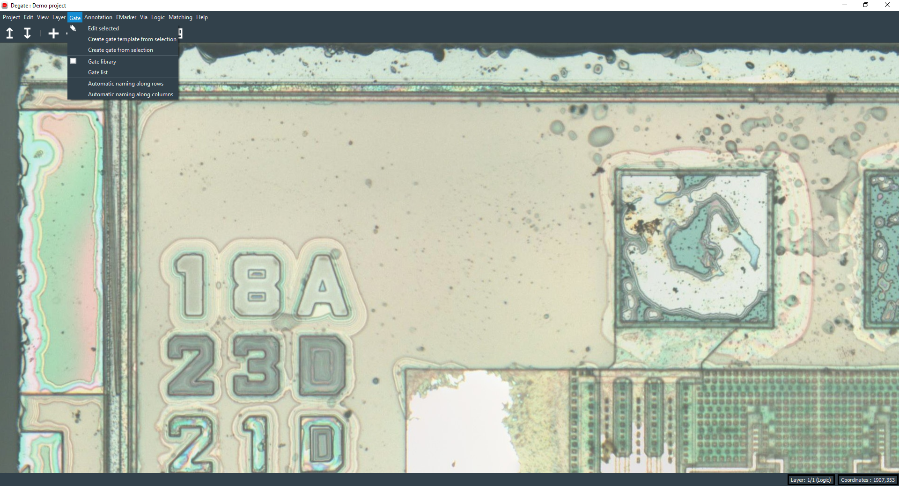
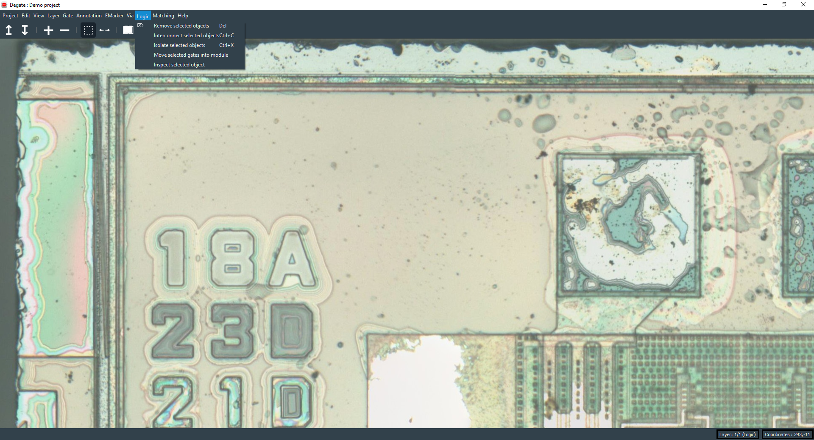
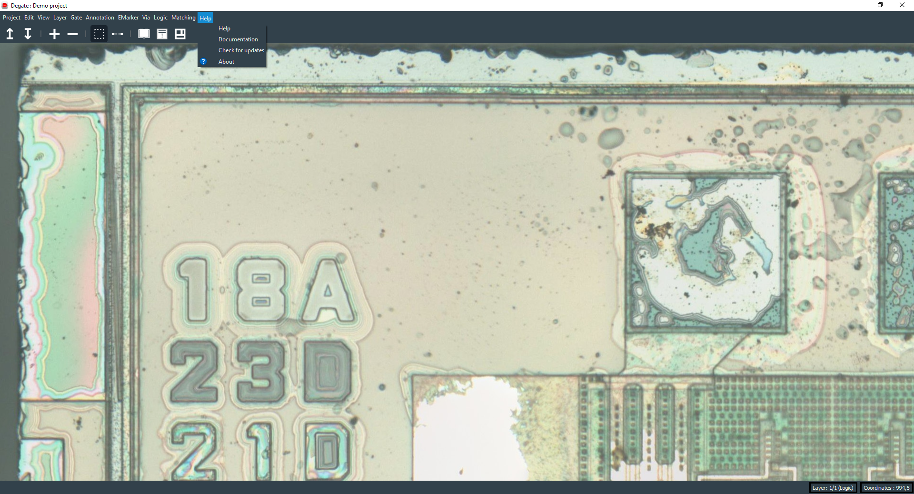
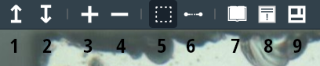

Degate main window
==================================

In this page, we will dig into the Degate main window. The Degate main window is composed of a top menu, a toolbar, a workspace and a notification bar.

.. image:: images/main_window.png
  :alt: Degate main window areas

- **1 (blue)**: top menu.
- **2 (red)**: toolbar.
- **3 (green)**: workspace.
- **4 (yellow)**: notification bar.

Top menu
-----

The top menu is where you will every possible action in the software. It is split in 11 submenu:

- The **project** submenu: create and load a project.
- The **edit** submenu: edit preferences.
- The **view** submenu: hide/show elements and configure the grid. 
- The **layer** submenu: edit layers.
- The **gate** submenu: create and edit gate and gate template.
- The **annotation** submenu: edit and create annotations.
- The **emarker** submenu: edit emarkers.
- The **via** submenu: edit vias.
- The **logic** submenu: remove, interconnect and isolate objects.
- The **matching** submenu: template, via and wire matching.
- The **help** submenu: list of shortcuts, documentation link and about dialog.

Project submenu
~~~~~

The project submenu offers the possibility to open, create and close a project. You can also edit project settings and create a subproject.

Edit submenu
~~~~~

The edit submenu offers access to the preferences dialog.

View submenu
~~~~~

The view submenu offers the possibility to hide or show objects (like gates, gates names, wires...), to enable/disable/configure the grid and to access the fullscreen mode.

Layer submenu
~~~~~

The layer submenu allows you to launch the layer edit dialog and to directly change the current layer background (it's a shortcut to the same functionality in the layer edit dialog).

Gate submenu
~~~~~

The gate submenu will help you to create a gate or gate template from selection, to edit a selected gate, to list gates templates, to list gates instances and a way to automatically name gates along rows or columns.

Annotation submenu
~~~~~

The annotation submenu will help you to create, edit and get a list of annotations.

EMarker submenu
~~~~~

The emarker submenu will allow you to edit an emarker.

Via submenu
~~~~~

The via submenu will allow you to edit a via.

Logic submenu
~~~~~

The logic submenu will help you to remove selected objects, to interconnect or isolate them, to move objects into a module or to inspect a selected object.

Matching submenu
~~~~~

The matching submenu will allow you to start template matching, via matching or wire matching dialogs.

Help submenu
~~~~~

To finish, the help menu will give you access to a shortcut list dialog, to a documentation redirection, to an update checker and to the about dialog (with a changelog, license...).

Toolbar
-----

The toolbar gives you access to actions and tools selection.

- **1**: Move to the upper layer (if possible).
- **2**: Move to the lower layer (if possible).
- **3**: Zoom in.
- **4**: Zoom out.
- **5**: Select the area selection tool (to create gates, annotation...). It's the blue rectangle created using the mouse right click.
- **6**: Select the wire creation tool.
- **7**: Open the gate library (list of all gates templates).
- **8**: Open the rule violation dialog (list of electric errors/warnings).
- **9**: Open the module dialog (to sort and export the extracted netlist).

Workspace area
-----

The workspace area is where you will work on the chip layers images, draw gates, draw wires, create annotations... It's where all the magic takes place.

Notification bar
-----

The notification bar will show messages on its left side and information, with the current layer position (and type) and the current coordinates, on the right side.